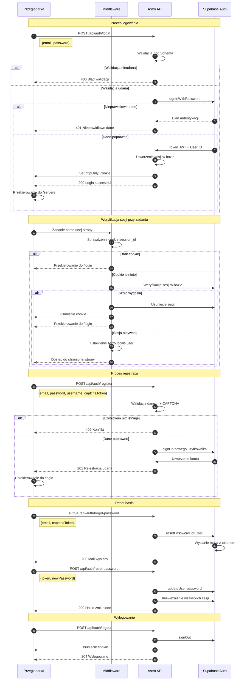

# Diagram Auth - Przepływ autentykacji

## Opis przepływu autentykacji

### Logowanie
1. Użytkownik wysyła dane logowania do API
2. API waliduje dane używając Zod Schema
3. Supabase Auth weryfikuje poświadczenia
4. Przy sukcesie tworzona jest sesja i ustawiane httpOnly cookie
5. Użytkownik przekierowywany do dashboard serwerów

### Weryfikacja sesji
1. Middleware sprawdza cookie przy każdym żądaniu
2. Weryfikuje sesję w bazie danych
3. Przy wygaśnięciu usuwa sesję i przekierowuje do logowania
4. Przy aktywnej sesji ustawia dane użytkownika w Astro.locals

### Rejestracja
1. Walidacja danych i CAPTCHA
2. Sprawdzenie czy użytkownik już istnieje
3. Utworzenie konta przez Supabase Auth
4. Przekierowanie do strony logowania

### Reset hasła
1. Żądanie resetu z CAPTCHA
2. Wysłanie maila z tokenem przez Supabase
3. Ustawienie nowego hasła z tokenem
4. Unieważnienie wszystkich istniejących sesji

### Bezpieczeństwo
- Rate limiting dla prób logowania (5 prób)
- Secure httpOnly cookies z SameSite=strict
- CAPTCHA dla rejestracji i resetu hasła
- TTL sesji: 24h dla gości, 1 dzień dla użytkowników
