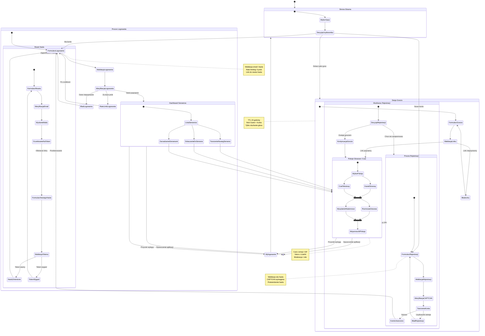

# Diagram Journey - Podróż użytkownika

## Opis podróży użytkownika

### Główne ścieżki

#### 1. Nowy użytkownik
- **Cel**: Utworzenie konta i dostęp do pełnej funkcjonalności
- **Ścieżka**: Strona główna → Rejestracja → Walidacja → Logowanie → Dashboard
- **Kluczowe punkty**: CAPTCHA, walidacja hasła, przekierowanie po sukcesie

#### 2. Powracający użytkownik  
- **Cel**: Szybki dostęp do serwerów i pokoi
- **Ścieżka**: Strona główna → Logowanie → Dashboard → Pokoje
- **Kluczowe punkty**: Rate limiting, opcja resetu hasła

#### 3. Użytkownik-gość
- **Cel**: Szybkie dołączenie bez rejestracji
- **Ścieżka**: Link zaproszenia → Formularz gościa → Pokoje głosowe
- **Kluczowe punkty**: TTL 24h, ograniczone uprawnienia, możliwość rejestracji

#### 4. Reset hasła
- **Cel**: Odzyskanie dostępu do konta
- **Ścieżka**: Logowanie → Reset → Email → Token → Nowe hasło → Logowanie
- **Kluczowe punkty**: CAPTCHA, token 24h, unieważnienie sesji

### Punkty decyzyjne

- **Typ użytkownika**: Nowy/Powracający/Gość
- **Walidacja danych**: Poprawne/Niepoprawne
- **Stan sesji**: Aktywna/Wygasła/Brak
- **Uprawnienia**: Pełne/Ograniczone (gość)

### Stany końcowe

- **Dashboard serwerów**: Pełny dostęp do funkcjonalności
- **Pokoje głosowe**: Aktywna komunikacja
- **Wylogowanie**: Powrót do strony głównej
- **Opuszczenie**: Zakończenie sesji

### Bezpieczeństwo i UX

- **Rate limiting**: Ochrona przed atakami brute force
- **CAPTCHA**: Ochrona przed botami
- **TTL sesji**: Automatyczne wylogowanie
- **Walidacja**: Sprawdzanie danych w czasie rzeczywistym
- **Komunikaty błędów**: Jasne informacje dla użytkownika
