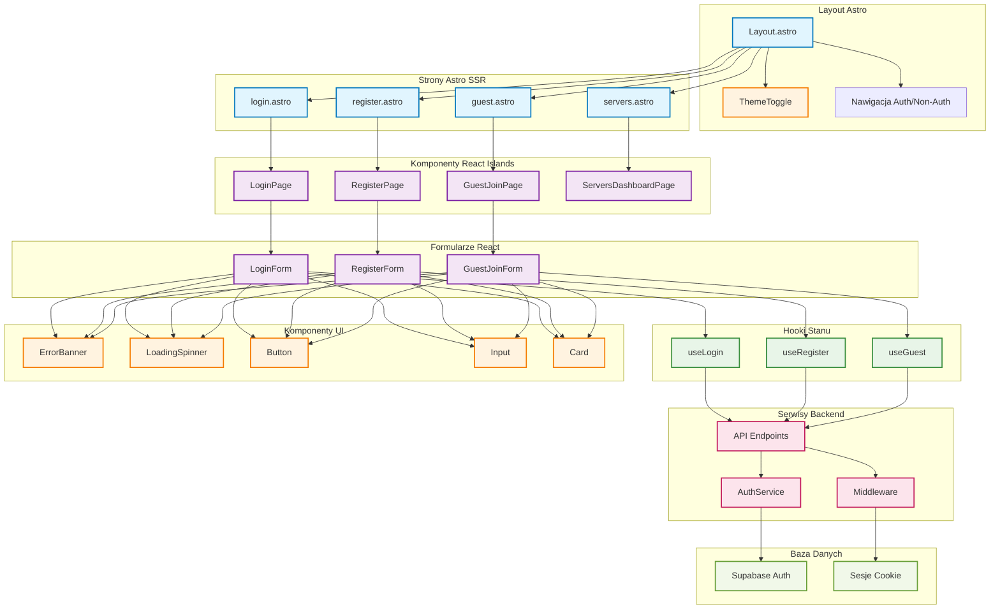

# Diagram UI - Architektura komponentów autentykacji

## Opis architektury UI

### Warstwa Astro (SSR/SSG)
- **Layout.astro**: Globalny wrapper z nawigacją i ThemeToggle
- **Strony Astro**: Renderowanie po stronie serwera z React Islands

### Warstwa React (Client-side)
- **Komponenty stron**: LoginPage, RegisterPage, GuestJoinPage
- **Formularze**: Dedykowane komponenty z walidacją
- **Hooki**: Zarządzanie stanem i komunikacja z API

### Warstwa UI
- **Komponenty shadcn/ui**: Button, Input, Card, Label
- **Komponenty pomocnicze**: ErrorBanner, LoadingSpinner, ThemeToggle

### Przepływ danych
1. Strony Astro renderują React Islands
2. Komponenty React używają hooków do zarządzania stanem
3. Hooki komunikują się z API endpoints
4. Middleware obsługuje sesje i przekazuje dane do Layout
5. Layout renderuje odpowiedni UI na podstawie stanu autentykacji
